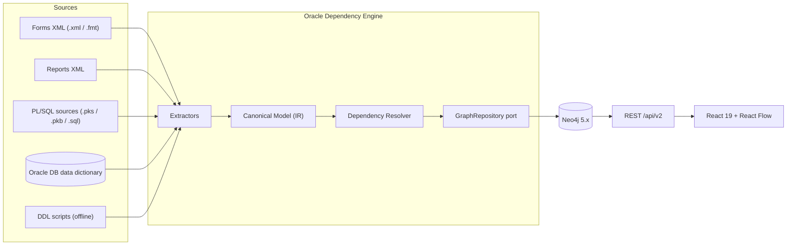
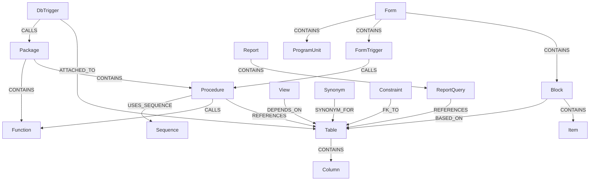
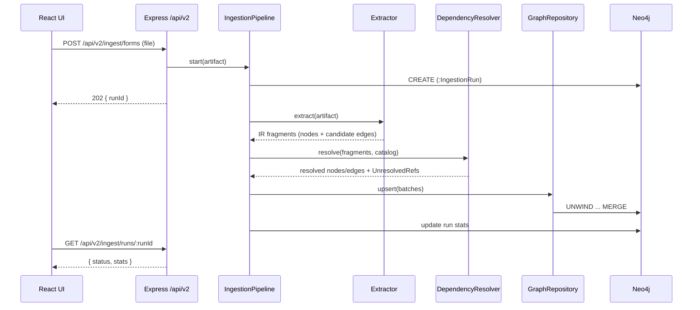

# Oracle Dependency Engine — Architecture

**Status:** Implemented (Phases A–E, see §13). Sample artifacts for trying the engine live in `samples/`; ingest them via the analyzer screens or `POST /api/v2/ingest/*`.
**Stack decision:** Implemented in Node.js/TypeScript (the current repo stack), architected with stack-agnostic contracts so the engine can be ported module-by-module to Java 21 / Spring Boot 3 (the documented target stack in [architecture.md](../architecture.md)).
**Schema source decision:** Live Oracle DB via `oracledb` (data dictionary) with file-based fallback (DDL scripts), behind a pluggable source adapter.

## 1. Purpose & scope

The repo today is a prototype: real (regex/XML) parsers for PL/SQL and Forms, simulated Reports/metadata services, and hardcoded `/api/graph` + `/api/impact/:nodeId` demo endpoints in [server.ts](../server.ts). Nothing persists; every analysis is in-memory per request.

The Dependency Engine turns this into a real system: every parsed artifact and every data-dictionary fact lands in a **single canonical dependency graph stored in Neo4j**, queried through versioned APIs, and visualized with the existing React Flow UI.

### Requirements traceability

| # | Requirement | Architecture section | Builds on (existing code) |
|---|---|---|---|
| 1 | Parse Oracle Forms metadata | §4 FormsExtractor | `FormsAnalyzerService` ([server/services/formsParser.ts](../server/services/formsParser.ts)) |
| 2 | Parse Oracle Reports metadata | §4 ReportsExtractor | replaces mock `ReportsAnalyzerService` ([server/services/reportsParser.ts](../server/services/reportsParser.ts)) |
| 3 | Parse PL/SQL packages | §4 PlsqlExtractor | `PlsqlAnalyzerService` ([server/services/plsqlParser.ts](../server/services/plsqlParser.ts)) |
| 4 | Parse Oracle schema metadata | §4 SchemaExtractor (`MetadataSource` port) | `MetadataDiscovererService` ([server/services/metadataDiscoverer.ts](../server/services/metadataDiscoverer.ts)) |
| 5 | Build dependency relationships | §5 Canonical model · §6 Dependency Resolver | per-parser `dependencies` fields |
| 6 | Store relationships in Neo4j | §7 Graph persistence | new (`neo4j-driver`) |
| 7 | Expose graph APIs | §8 Graph APIs `/api/v2` | demo `GET /api/graph` in [server.ts](../server.ts) |
| 8 | Build impact analysis APIs | §9 Impact APIs | demo `GET /api/impact/:nodeId` in [server.ts](../server.ts) |
| 9 | Integrate with React Flow | §10 Visualization | [src/screens/KnowledgeGraph.tsx](../src/screens/KnowledgeGraph.tsx) (`@xyflow/react` 12 + dagre) |

## 2. System overview

```
┌────────────────────────────── Presentation ───────────────────────────────┐
│ React 19 + @xyflow/react 12 + dagre                                        │
│ KnowledgeGraph · ImpactAnalyzer · Forms/Reports/PLSQL analyzers · Discovery│
└──────────────────────────────────┬─────────────────────────────────────────┘
                                   │ REST /api/v2 (OpenAPI 3.1 contract)
┌──────────────────────────────────┴─────────────────────────────────────────┐
│ API Layer (Express now → Spring Boot later)                                 │
│  Ingestion API · Graph API · Impact API · Object Search API                 │
├──────────────────────────────────────────────────────────────────────────── ┤
│ Application Services                                                        │
│  IngestionPipeline · DependencyResolver · ImpactAnalysisService             │
├──────────────────────────────────────────────────────────────────────────── ┤
│ Canonical Domain Model (stack-agnostic IR)                                  │
│  OracleObjectNode · DependencyEdgeRecord · taxonomies · canonical IDs       │
├──────────────┬──────────────┬───────────────┬───────────────────────────────┤
│ Extractor    │ Extractor    │ Extractor     │ Extractor (port:              │
│ Forms        │ Reports      │ PL/SQL        │ MetadataSource)               │
│ (XML)        │ (XML)        │ (.pks/.pkb/   │  ├ LiveOracleSource (oracledb)│
│              │              │  ALL_SOURCE)  │  └ DdlFileSource (offline)    │
├──────────────┴──────────────┴───────────────┴───────────────────────────────┤
│ Graph Persistence (port: GraphRepository → Neo4j adapter, neo4j-driver)     │
└──────────────────────────────────────────────────────────────────────────── ┘
       Neo4j 5.x (Docker Compose; APOC)            Oracle DB (read-only)
```



## 3. Portability strategy (hybrid mandate)

The engine is written in Node.js/TypeScript but every boundary is designed to survive a Spring Boot port:

1. **Domain layer is plain types.** `server/domain/` contains only TypeScript interfaces and pure functions (no Node APIs), mirrored by JSON Schema files — these map 1:1 to Java records/DTOs.
2. **Persistence behind a port.** All graph access goes through a `GraphRepository` interface; the Neo4j adapter is the only file importing `neo4j-driver`. Cypher lives in standalone `server/graph/cypher/*.cypher` template files, directly reusable from the Java driver or Spring Data Neo4j `@Query`.
3. **Contract-first HTTP.** All `/api/v2` endpoints are defined in an OpenAPI 3.1 spec (`docs/openapi-dependency-engine.yaml`, generated at implementation time). Express handlers validate against it (zod); Spring controllers can later be generated from the same spec.
4. **Extractors and sources are ports.** `Extractor<TInput>` and `MetadataSource` interfaces allow Java implementations to replace Node ones module-by-module, with the Neo4j graph as the shared integration point during migration.

## 4. Ingestion layer (requirements 1–4)

Each extractor consumes raw artifacts and emits **canonical model fragments** — nodes plus *candidate* edges with evidence. Extractors never write to Neo4j directly; the pipeline is always `extract → resolve → persist`.

### 4.1 FormsExtractor

- **Input:** Oracle Forms XML (output of Oracle's `frmf2xml`/`frmb2xml` converters) and `.fmt`. Binary `.fmb` is **rejected with a clear message** instructing conversion — no more silent mock fallback.
- **Builds on:** the existing `fast-xml-parser` traversal in `FormsAnalyzerService` (Module → FormModule → Block/Item/Trigger/LOV/ProgramUnit).
- **Emits:** `Form`, `Block`, `Item`, `FormTrigger`, `ProgramUnit` nodes; `CONTAINS` structure edges; `(Block)-[:BASED_ON]->(Table)` from the block's `baseTable`; trigger and program-unit PL/SQL bodies are handed to the shared SQL reference extractor (§4.3) so calls like `HR_PKG.VALIDATE_EMP` become candidate `CALLS` edges.

### 4.2 ReportsExtractor

- **Input:** Oracle Reports XML (output of `rwconverter`). Replaces the current 100%-simulated parser.
- **Approach:** `fast-xml-parser` traversal of `report → data → dataSource → select` (queries), `report → parameters`, `programUnits`, layout `field` sources — mirroring the structure of the Forms parser.
- **Emits:** `Report`, `ReportQuery`, `Parameter`, `ProgramUnit` nodes; query SQL text goes through the SQL reference extractor → `(ReportQuery)-[:REFERENCES {operation:'SELECT'}]->(Table|View)` candidates; report program units behave like Forms program units.

### 4.3 PlsqlExtractor (+ shared SQL reference extractor)

- **Input:** `.pks` / `.pkb` / `.sql` uploads **and** `ALL_SOURCE` rows from the live DB (same code path — source text in, fragments out).
- **Builds on:** the regex lexer in `PlsqlAnalyzerService` (package name, procedures/functions, complexity, line ranges), extended with:
  - package-qualified call detection (`PKG.PROC(` / `PKG.FUNC(`),
  - sequence usage (`SEQ.NEXTVAL` / `SEQ.CURRVAL`),
  - `EXECUTE IMMEDIATE` detection — dynamic SQL produces **low-confidence** candidate edges (§5) instead of being missed silently,
  - DML operation classification (which statement type referenced each table).
- **Emits:** `Package`, `PackageBody`, `Procedure`, `Function` nodes (complexity/LOC kept as node properties); `CALLS`, `REFERENCES {operation}`, `USES_SEQUENCE` candidate edges.
- The **SQL reference extractor** is a shared module (table/view refs after `FROM|JOIN|UPDATE|INSERT INTO|DELETE FROM|MERGE INTO`, call refs, sequence refs) used by all three artifact extractors, so Forms triggers, Report queries, and PL/SQL bodies produce consistent edges.

### 4.4 SchemaExtractor (port: `MetadataSource`)

Two adapters behind one interface:

- **`LiveOracleSource`** — `oracledb` in **thin mode** (pure JS, no Instant Client; requires Oracle 12.1+, matching the stated Oracle 12c target). Read-only dictionary queries:
  `ALL_OBJECTS`, `ALL_TABLES`, `ALL_TAB_COLUMNS`, `ALL_VIEWS`, `ALL_MVIEWS`, `ALL_DEPENDENCIES`, `ALL_CONSTRAINTS`, `ALL_CONS_COLUMNS`, `ALL_TRIGGERS`, `ALL_SEQUENCES`, `ALL_SYNONYMS`, `ALL_SOURCE` (fed to the PlsqlExtractor).
- **`DdlFileSource`** — evolves the regex `CREATE …` scan in `MetadataDiscovererService`, **dropping all randomly generated mock values** (dependencies counts, status, dates). Offline-only estates get a graph built purely from files.

**`ALL_DEPENDENCIES` is the backbone**: it yields authoritative object-to-object `DEPENDS_ON` edges inside the database (confidence 1.0). Parsed-source edges fill the gaps the dictionary cannot see — client-side Forms/Reports artifacts and dynamic SQL.

**Emits:** `Table`, `Column`, `View`, `MaterializedView`, `DbTrigger`, `Sequence`, `Synonym`, `Index`, `Constraint` nodes; `DEPENDS_ON`, `FK_TO`, `SYNONYM_FOR`, `ATTACHED_TO`, `CONTAINS` (table→column) edges.

## 5. Canonical domain model (the IR)

### Canonical IDs

Deterministic IDs make ingestion idempotent: `<type>:<schema>.<name>[#<sub>]`, uppercased name parts.

| Example | Object |
|---|---|
| `table:HR.EMPLOYEES` | table |
| `package:HR.HR_PKG` · `procedure:HR.HR_PKG.VALIDATE_EMP` | package and member |
| `form:APP.EMP_MAINT` · `formtrigger:APP.EMP_MAINT.EMPLOYEES#WHEN-VALIDATE-ITEM` | form and block trigger |
| `unresolved:?.SOME_NAME` | unresolved reference |

### Types

```ts
interface OracleObjectNode {
  id: string;            // canonical ID (unique)
  type: NodeType;        // taxonomy below
  schema: string | null; // null until resolved
  name: string;
  group: 'presentation' | 'logic' | 'data'; // matches existing UI grouping
  status?: 'VALID' | 'INVALID' | 'UNRESOLVED';
  properties: Record<string, string | number | boolean>; // complexity, loc, lastDdlTime…
  source: SourceRef[];   // provenance: artifact + ingestion run
}

interface DependencyEdgeRecord {
  from: string;                   // canonical ID (the dependent)
  to: string;                     // canonical ID (the dependency)
  relType: RelType;               // taxonomy below
  operation?: 'SELECT' | 'INSERT' | 'UPDATE' | 'DELETE' | 'EXECUTE' | 'REFERENCE';
  confidence: number;             // 1.0 dictionary · 0.8 parsed static SQL · 0.4 dynamic-SQL heuristic
  evidence: {
    sourceType: 'DICTIONARY' | 'PLSQL_SOURCE' | 'FORMS_XML' | 'REPORTS_XML' | 'DDL_FILE';
    file?: string;
    line?: number;
  }[];
}
```

### Node taxonomy

Neo4j labels (every node also carries the `:OracleObject` super-label):

`Form, Block, Item, FormTrigger, ProgramUnit, Report, ReportQuery, Parameter, Package, PackageBody, Procedure, Function, Table, Column, View, MaterializedView, DbTrigger, Sequence, Synonym, Index, Constraint, UnresolvedRef`

### Relationship taxonomy

| Category | Relationship types |
|---|---|
| Structural | `CONTAINS` (form→block→item, package→subprogram, table→column, report→query) |
| Behavioral | `CALLS`, `REFERENCES {operation}`, `USES_SEQUENCE`, `QUERIES` |
| Schema | `DEPENDS_ON` (from `ALL_DEPENDENCIES`), `FK_TO`, `BASED_ON` (block→table, view→table), `ATTACHED_TO` (trigger→table), `SYNONYM_FOR` |
| Provenance | `PRODUCED_BY` (object→`IngestionRun`) |



### Direction convention (critical)

The current demo data mixes directions; the engine fixes this with one rule: **every behavioral/schema edge points dependent → dependency**:

```
(form)-[:CALLS]->(package)-[:REFERENCES]->(table)
```

Consequences:

- *"What does X depend on?"* = **outgoing** traversal from X (UI "downstream" panel).
- *"What breaks if X changes?"* (impact / blast radius) = **incoming** traversal to X (UI "upstream" panel).

## 6. Dependency resolution engine (requirement 5)

A pipeline stage between extraction and persistence:

1. **Normalize** — uppercase unquoted identifiers, preserve quoted ones, strip default-schema prefixes.
2. **Resolve** raw references against the known-object catalog, in priority order: schema-qualified exact match → current-schema match → private synonym expansion (chase `SYNONYM_FOR`) → public synonym. The catalog is the live-DB dictionary when available, otherwise everything ingested so far.
3. **Cross-artifact linking** — Forms trigger and Report program-unit PL/SQL bodies run through the PL/SQL reference extractor, so a form trigger calling `HR_PKG.VALIDATE_EMP` yields `(formtrigger)-[:CALLS]->(procedure:HR.HR_PKG.VALIDATE_EMP)`.
4. **Unresolved references become `UnresolvedRef` nodes** — never dropped. They surface coverage gaps in the UI and are re-resolved automatically on later ingestion runs (e.g. the schema arrives after the forms).
5. **Confidence & dedupe** — the same logical edge from multiple evidence sources merges into one relationship keeping the **max** confidence and the **union** of evidence entries.

## 7. Neo4j persistence (requirement 6)

- **Driver:** `neo4j-driver` (official Node driver) behind the `GraphRepository` port. Local dev via `docker-compose.yml` running `neo4j:5-community` with APOC.
- **Config (added to `.env.example` at implementation time):** `NEO4J_URI`, `NEO4J_USER`, `NEO4J_PASSWORD` — plus `ORACLE_USER`, `ORACLE_PASSWORD`, `ORACLE_CONNECT_STRING` for `LiveOracleSource`, and `IMPACT_MAX_DEPTH`.

### Graph schema bootstrap

```cypher
CREATE CONSTRAINT oracle_object_id IF NOT EXISTS
FOR (o:OracleObject) REQUIRE o.id IS UNIQUE;

CREATE INDEX oracle_object_type   IF NOT EXISTS FOR (o:OracleObject) ON (o.type);
CREATE INDEX oracle_object_schema IF NOT EXISTS FOR (o:OracleObject) ON (o.schema);

CREATE FULLTEXT INDEX oracle_object_search IF NOT EXISTS
FOR (o:OracleObject) ON EACH [o.name];
```

### Idempotent batch ingestion

Nodes and edges are upserted with `UNWIND … MERGE` in batches of ~1,000, keyed on canonical ID, so re-ingesting an artifact updates rather than duplicates:

```cypher
// upsert-nodes.cypher (one statement per label, avoiding dynamic-label APOC dependency)
UNWIND $batch AS row
MERGE (o:OracleObject:Table {id: row.id})
SET  o.name = row.name, o.schema = row.schema, o.type = row.type,
     o.group = row.group, o.status = row.status, o += row.props
WITH o
MATCH (r:IngestionRun {id: $runId})
MERGE (o)-[:PRODUCED_BY]->(r);
```

```cypher
// upsert-edges.cypher (one template per relationship type)
UNWIND $batch AS row
MATCH (a:OracleObject {id: row.from})
MATCH (b:OracleObject {id: row.to})
MERGE (a)-[rel:REFERENCES]->(b)
SET rel.operation  = coalesce(row.operation, rel.operation),
    rel.confidence = CASE WHEN rel.confidence IS NULL OR row.confidence > rel.confidence
                          THEN row.confidence ELSE rel.confidence END,
    rel.evidence   = coalesce(rel.evidence, []) + row.evidence;
```

### Ingestion runs (provenance)

Every upload/discovery creates `(:IngestionRun {id, startedAt, finishedAt, source, fileName, stats})`; produced objects link via `[:PRODUCED_BY]`. This enables provenance display, diffing two runs, and stale-object cleanup.



## 8. Graph APIs (requirement 7) — `/api/v2`, OpenAPI-first

Existing demo endpoints (`/api/graph`, `/api/impact/:nodeId`, `/api/dashboard`, …) stay untouched until frontend cutover; the engine ships a new versioned namespace:

| Endpoint | Purpose |
|---|---|
| `GET /api/v2/graph?types=&schema=&search=&limit=` | Filtered subgraph in the existing `GraphData` shape. Server-side windowing — never ship 50k nodes to the browser. |
| `GET /api/v2/graph/nodes/:id` | Node detail: properties, evidence, in/out edge counts, provenance. |
| `GET /api/v2/graph/nodes/:id/neighbors?direction=in\|out\|both&depth=1` | Progressive expansion for React Flow click-to-expand. |
| `GET /api/v2/objects?search=&type=&schema=&page=&pageSize=` | Paginated full-text object search (replaces the hardcoded `mockObjects` in ImpactAnalyzer). |
| `GET /api/v2/stats` | Real per-type counts, invalid counts, unresolved-ref counts (replaces hardcoded `/api/dashboard` numbers). |
| `POST /api/v2/ingest/forms` · `/reports` · `/plsql` · `/schema` | File ingestion (multer, as today). Returns `202 { runId }` for large artifacts. |
| `POST /api/v2/ingest/discover` | Live-DB discovery via `LiveOracleSource` (schemas list in body). |
| `GET /api/v2/ingest/runs/:id` | Run status + stats (`nodesUpserted`, `edgesUpserted`, `unresolvedRefs`). |

The wire format for graph payloads **keeps the proven `GraphData` contract** from [src/types.ts](../src/types.ts):

```ts
interface GraphNode { id: string; label: string; type: string; group: string; }
interface GraphEdge { source: string; target: string; label: string; }
interface GraphData { nodes: GraphNode[]; edges: GraphEdge[]; }
```

## 9. Impact analysis APIs (requirement 8)

`ImpactAnalysisService` runs Cypher variable-length traversals over the persisted graph — replacing the hardcoded `t_emp` / `p_hr` demo responses with computed results.

### Endpoints

- `GET /api/v2/impact/:id?depth=5&direction=upstream|downstream|both`

  ```ts
  interface ImpactResultV2 {
    target: { id: string; label: string; type: string };
    upstream: ImpactedObject[];    // who breaks if target changes (incoming traversal)
    downstream: ImpactedObject[];  // what target depends on (outgoing traversal)
    riskLevel: 'Low' | 'Medium' | 'High' | 'Critical';
    impactScore: number;           // 0..100, computed (formula below)
    recommendation: string;
    byType: Record<string, number>;
    depthMap: Record<number, number>;
  }
  interface ImpactedObject {
    id: string; label: string; type: string;
    depth: number; viaPath: string[]; confidence: number;
  }
  ```

- `GET /api/v2/impact/:id/paths?to=:otherId` — shortest dependency paths between two objects ("why does this form break if I alter this column?").

### Blast-radius query

Impact of changing X = everything that *reaches* X through dependency edges:

```cypher
MATCH (target:OracleObject {id: $id})
MATCH p = (d:OracleObject)-[:CALLS|REFERENCES|DEPENDS_ON|BASED_ON|USES_SEQUENCE|FK_TO|ATTACHED_TO|QUERIES*1..5]->(target)
WITH d, min(length(p)) AS depth,
     max(reduce(c = 1.0, r IN relationships(p) | c * coalesce(r.confidence, 1.0))) AS confidence
RETURN d.id AS id, d.name AS label, d.type AS type, depth, confidence
ORDER BY depth ASC;
```

> Implementation note: Cypher does not allow a parameter in the variable-length bound (`*1..$depth` is invalid). The depth is interpolated into the query string from a **clamped, safelisted integer** (`1 ≤ depth ≤ IMPACT_MAX_DEPTH`), or APOC `apoc.path.subgraphNodes` is used instead.

### Risk scoring (computed, tunable)

```
impactScore = clamp(0..100,
    Σ over impacted ( typeWeight[type] × depthDecay^(depth−1) × confidence )
    + complexityBonus(target)            // from parser metrics stored on the node
)
riskLevel:  > 80 Critical · > 60 High · > 35 Medium · else Low
```

Default type weights (configurable): form 10, report 8, package 6, table 5, procedure/function 4, view 3, trigger 3, other 1. `depthDecay` default 0.6 — direct dependents dominate the score.

**Optional (feature-flagged):** Gemini (`@google/genai`, already a dependency) generates the human-readable `recommendation` from the computed impact set; a deterministic template is the fallback when no API key is configured.

## 10. React Flow integration (requirement 9)

The UI contract is already proven — keep it and feed it real data:

- `GET /api/v2/graph` returns the exact `GraphData` shape [KnowledgeGraph.tsx](../src/screens/KnowledgeGraph.tsx) consumes today, so the dagre layout, custom nodes, search, and type filters keep working. New `type` values (`procedure`, `function`, `synonym`, `column`, `unresolved`, …) are added to its `typeConfig` map.
- **Progressive expansion** for large estates: KnowledgeGraph starts from a filtered/seeded subgraph (`limit` + filters); double-clicking a node fetches `/api/v2/graph/nodes/:id/neighbors` and appends nodes/edges, then re-runs dagre. The existing client-side impact-mode traversal moves server-side via `/api/v2/impact/:id`.
- **ImpactAnalyzer** sidebar switches from its hardcoded `mockObjects` array to `/api/v2/objects?search=`; the impact fetch switches to `/api/v2/impact/:id`.
- **Dashboard / MetadataDiscovery** read `/api/v2/stats` and real ingestion-run results instead of simulated counts.

## 11. Proposed module layout

```
server/
  domain/                  # stack-agnostic canonical model (no Node imports)
    model.ts               # OracleObjectNode, DependencyEdgeRecord, taxonomies
    ids.ts                 # canonical ID builders/parsers
    schema/                # JSON Schema mirror of the IR (portable contract)
  extractors/
    types.ts               # Extractor<TInput> port
    forms/formsExtractor.ts        # evolves services/formsParser.ts
    reports/reportsExtractor.ts    # replaces services/reportsParser.ts mock
    plsql/plsqlExtractor.ts        # evolves services/plsqlParser.ts
    plsql/sqlReferenceExtractor.ts # shared SQL → table/call/sequence scanner
    schema/metadataSource.ts       # MetadataSource port
    schema/liveOracleSource.ts     # oracledb adapter (thin mode)
    schema/ddlFileSource.ts        # evolves services/metadataDiscoverer.ts
  resolution/
    resolver.ts            # normalize → resolve → link pipeline
    catalog.ts             # known-object catalog + synonym chains
  graph/
    graphRepository.ts     # port interface
    neo4jGraphRepository.ts
    neo4jClient.ts         # driver/session lifecycle
    cypher/                # *.cypher templates (portable to Spring)
  impact/
    impactService.ts
    riskScoring.ts
  ingestion/
    ingestionPipeline.ts   # orchestrates extract → resolve → persist + IngestionRun
  api/
    v2/graph.routes.ts
    v2/impact.routes.ts
    v2/ingest.routes.ts
    v2/objects.routes.ts
    dto.ts                 # zod schemas aligned with the OpenAPI spec
docs/
  dependency-engine-architecture.md   # this document
  openapi-dependency-engine.yaml      # generated at implementation time
docker-compose.yml         # neo4j:5-community + APOC
```

New runtime dependencies at implementation time (none installed yet): `neo4j-driver`, `oracledb`, `zod`.

## 12. Constraints, risks & non-goals

- **Binary Forms/Reports files**: `.fmb` and `.rdf` are proprietary binaries; the engine consumes the XML output of Oracle's converters (`frmf2xml` / `frmb2xml`, `rwconverter`). The current silent mock fallback for `.fmb` is removed in favor of an explicit error with conversion guidance.
- **Dynamic SQL is heuristic**: `EXECUTE IMMEDIATE` references can't be fully resolved statically — hence per-edge confidence scores rather than false certainty.
- **Regex parsing limits**: the PL/SQL lexer is pragmatic, not a full grammar. The architecture isolates it behind the extractor port so a real parser (e.g. ANTLR PL/SQL grammar) can replace it later without touching the model, resolver, or APIs.
- **Scale**: dictionary-driven estates can reach 10⁴–10⁵ objects. Mitigations: batched `UNWIND` ingestion, async runs, server-side graph windowing, full-text search index, progressive UI expansion.
- **Security**: Oracle access is read-only (dictionary views only); Neo4j credentials via env; no user-supplied Cypher — all queries are parameterized templates.
- **Non-goals (this design)**: code generation changes (React/Spring generators stay as-is), authn/authz, multi-tenant graphs, scheduled re-discovery.

## 13. Phased implementation roadmap (for later approval)

| Phase | Scope | Ships independently? |
|---|---|---|
| **A** | Domain model + canonical IDs; Neo4j infra (compose, client, repository port, schema bootstrap) | yes — graph reachable, empty |
| **B** | Extractor upgrades — **Reports first** (it's pure mock today), then PL/SQL call/sequence extraction, Forms `.fmb` rejection, DdlFileSource de-mocking | yes — richer analysis screens |
| **C** | Resolver + IngestionPipeline + IngestionRuns (artifacts start landing in Neo4j) | yes — graph fills up |
| **D** | `/api/v2` graph/impact/objects/stats endpoints + LiveOracleSource discovery | yes — APIs computed from Neo4j |
| **E** | Frontend cutover (KnowledgeGraph progressive expansion, ImpactAnalyzer real search, Dashboard stats); retire demo endpoints | yes — demo data gone |
